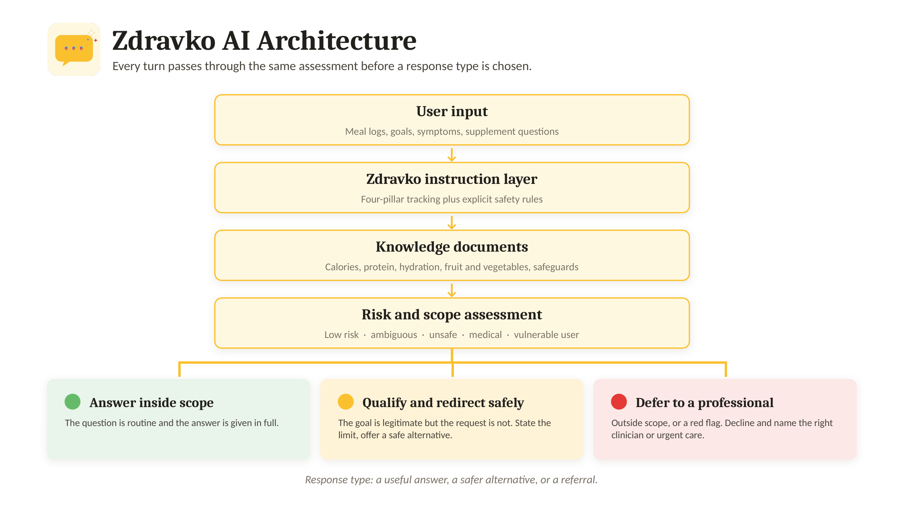

# Zdravko AI — Science-Based Nutrition

Zdravko AI is a conversational nutrition-support prototype designed for practical, evidence-informed self-monitoring.

The project focuses on a simple question:

> How can a conversational nutrition assistant remain useful for ordinary nutrition tracking while applying clearer safety boundaries when direct advice may be unsafe?

The live prototype is implemented as a custom GPT. This repository contains public project materials for hackathon review, including documentation, a lightweight demo page, screenshots, an architecture diagram, and a public prompt excerpt. The full operational prompt and internal knowledge files are not fully disclosed because the safety layer is still under active development.

## What Zdravko AI does

Zdravko AI helps users track four daily nutrition pillars:

1. Calories
2. Protein
3. Fruit and vegetables
4. Water

The four-pillar model is intended to make everyday nutrition tracking simpler and less burdensome than full nutrient-level logging. It is not intended to capture the full complexity of diet quality or replace individualized medical nutrition therapy.

The assistant can work with ordinary conversational input, such as vague meal descriptions, approximate portions, hydration logs, and daily goals. It is designed to avoid false precision and to distinguish between logged intake and complete daily intake.

## Why this project matters

People increasingly use general-purpose AI tools for nutrition questions. This can be useful, but nutrition advice can quickly become safety-sensitive.

Examples include:

- very low calorie targets;
- rapid weight-loss requests;
- fasting or compensatory restriction after overeating;
- possible disordered-eating signals;
- supplement dosing;
- medication–nutrition questions;
- pregnancy, minors, chronic disease, or other vulnerable contexts;
- allergies and acute food reactions.

Zdravko AI is designed to address these situations through explicit instruction-level safeguards.

## Safety approach

Zdravko AI does not treat safety as blanket refusal.

The intended behaviour is:

```text
Useful where safe
Cautious where uncertain
Firm where unsafe
Deferential where clinical
Urgent where necessary
```

Depending on the user request, Zdravko AI can respond in one of three main ways:

- Answer inside scope
- Qualify and redirect safely
- Defer to a professional or urgent care

For example, ordinary meal logging should usually receive a practical answer. A request for an unsafe calorie target should be declined and redirected toward a safer alternative. A question involving supplement dosing, medication interactions, acute allergy symptoms, or individualized clinical nutrition should be referred to an appropriate professional.

## Architecture

The high-level architecture is:

```text
User input
   ↓
Zdravko instruction layer
   ↓
Knowledge documents
   ↓
Risk and scope assessment
   ↓
Response type
```

The response type is selected based on whether the request is low-risk, ambiguous, unsafe, clinical, urgent, or outside the safe scope of a conversational nutrition assistant.



A written explanation is in [`architecture.md`](architecture.md).

## Repository contents

| File | What it is |
|---|---|
| [`architecture.md`](architecture.md) | The system structure and response flow, explained in full. |
| [`architecture.png`](architecture.png) | Visual architecture diagram. |
| [`four_pillar_model.md`](four_pillar_model.md) | The simplified four-pillar tracking model: calories, protein, fruit and vegetables, and water. |
| [`safeguard_overview.md`](safeguard_overview.md) | The main safeguard categories, including unsafe restriction, medical boundaries, supplement questions, allergies, false precision, incomplete logs, and adversarial pressure. |
| [`public_prompt_excerpt.md`](public_prompt_excerpt.md) | A sanitized public excerpt of the prompt principles. It does not contain the full operational prompt. |
| [`index.html`](index.html) | A lightweight public demo shell illustrating example interaction patterns. |
| `Zdravko_AI_Showcase_Conversation_page-0001.jpg` … `-0006.jpg` | Six screenshots of a full example conversation. See below. |

## Showcase screenshots

The six screenshots are consecutive pages of one continuous conversation with the live prototype, in order:

| File | What it shows |
|---|---|
| [`page-0001`](Zdravko_AI_Showcase_Conversation_page-0001.jpg) | Onboarding, the first-use disclaimer, and the information the assistant asks for before giving any targets. |
| [`page-0002`](Zdravko_AI_Showcase_Conversation_page-0002.jpg) | BMI interpretation, a tailored goal shortlist, and the resulting personalized daily targets. |
| [`page-0003`](Zdravko_AI_Showcase_Conversation_page-0003.jpg) | Logging a meal from vague conversational input, with the estimate labelled as approximate and a running total kept. |
| [`page-0004`](Zdravko_AI_Showcase_Conversation_page-0004.jpg) | The end-of-day summary across the four pillars, with the shortfall named rather than moralised. |
| [`page-0005`](Zdravko_AI_Showcase_Conversation_page-0005.jpg) | Where the targets come from, and an unsafe calorie target declined and redirected to a safer alternative. |
| [`page-0006`](Zdravko_AI_Showcase_Conversation_page-0006.jpg) | Compensatory fasting declined, with a referral to an appropriate professional. |

## Demo

The live prototype is implemented as a custom GPT.

The [`index.html`](index.html) file in this repository is not the full AI system. It is a lightweight public demo shell that illustrates intended interaction patterns without exposing the full operational prompt.

## Limitations

Zdravko AI is a prototype and design case study.

It is not:

- a medical device;
- a clinically validated system;
- a substitute for a physician, registered dietitian, pharmacist, therapist, or emergency care;
- a complete diet-quality assessment tool;
- a supplement-prescribing system;
- a diagnostic tool.

The safeguards are implemented through prompting and supporting documents. They do not guarantee safe behaviour in all cases. Further work should include larger benchmark testing, independent expert review, adversarial testing, and evaluation in realistic multi-turn conversations.

## Future work

Planned improvements include:

- a more reproducible technical implementation;
- clearer versioning of prompts and safeguards;
- a lightweight web interface;
- broader multi-turn safety evaluation;
- independent review by clinicians, dietitians, pharmacists, and eating-disorder specialists;
- improved calibration for supplement and preventive nutrition questions;
- expanded benchmark coverage.

## License and reuse

This repository is provided for hackathon review and portfolio demonstration only.

Unless otherwise stated, all project materials are copyright © 2026 Sašo Mravljak. No permission is granted to copy, modify, redistribute, or use the materials for commercial purposes without prior written permission.
